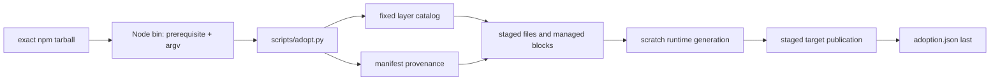

# Deterministic Installer Design

**Spec**: `.specs/features/deterministic-installer/spec.md`
**Surface**: `.specs/features/deterministic-installer/dx.md`
**Status**: Approved

---

## Architecture Overview

Use a dependency-free Node bin as a process adapter around `scripts/adopt.py`. The bin proves the
Python prerequisite and forwards argv/stdout/stderr. The existing adopter remains the only planner,
ownership classifier, stager, publisher, rollback owner, and manifest writer.

The adopter gets three bounded ownership corrections. Provider role templates become source-owned
after hash-proven migration from old manifests. Consumer knowledge is seeded from neutral adoption
templates and never sourced from this repository's populated knowledge tree. Files retired by a newer
release are removed only when the old manifest and current bytes still prove source ownership.



### Considered approaches

| Approach | Result | Trade-off |
| --- | --- | --- |
| Thin Node bin over the Python adopter | Chosen | Smallest diff; one mutation engine; retains established safety and tests; requires explicit Python prerequisite. |
| Reimplement the adopter in Node | Rejected | Removes Python prerequisite but duplicates hashing, ownership, rollback, symlink safety, layer resolution, and tests. |
| npm install lifecycle hook | Rejected | Hides target mutation inside package acquisition, weakens preview/approval, and conflicts with deterministic no-hook behavior. |

---

## Code Reuse Analysis

### Existing Components to Leverage

| Component | Location | How to Use |
| --- | --- | --- |
| Adoption CLI and engine | `scripts/adopt.py` | Keep all public verbs, layer resolution, manifest validation, conflict collection, staging, atomic publication, and rollback. |
| Adoption integration suite | `scripts/test_adopt.py` | Extend the canonical disposable-target suite; do not create a parallel installer suite. |
| Runtime renderer | `.agents/skills/workflow-config/scripts/workflow_config.py` | Continue scratch rendering of 18 packets from staged templates and preserved local config. |
| Adoption instruction blocks | `templates/adoption/agents/` | Continue marker-delimited AGENTS/CLAUDE composition and recorded block hashing. |
| Product context scaffold | `templates/adoption/product/AGENT-CONTEXT.md` | Preserve missing-only consumer ownership. |
| Explicit conflict transfer | `resolve --replace` in `scripts/adopt.py` | Keep reviewed legacy file replacement; do not invent another merge system. |

### Integration Points

| System | Integration Method |
| --- | --- |
| npm/npx | One `bin` entry and explicit `files` allowlist in `package.json`; local tarball smoke uses `npm exec --package`. |
| Python | Node `spawnSync`/equivalent with `shell: false`, foreground stdio, and a prior `3.11.0` version probe. |
| Consumer filesystem | Existing adopter plan/stage/publish path; manifest remains last write. |
| Git | Existing `resolve` clean-root/HEAD guard only; install/update does not require Git. |

---

## Components

### Node Package Adapter

- **Purpose**: Expose the adopter as the `my-workflow` npm executable.
- **Location**: `bin/my-workflow.js`
- **Interfaces**:
  - `my-workflow <plan|apply|resolve|status> ...` forwards arguments and process exit.
  - `plan`, `apply`, and `resolve` add `--layers full` only when the caller supplies no layer selector.
  - Python prerequisite failure returns the exact DX error and exit `2`.
- **Dependencies**: Node standard library, packaged `scripts/adopt.py`, `python3 >=3.11.0`.
- **Reuses**: Existing adopter parser and output; no command parsing duplication beyond prerequisite
  detection.

### Ownership Classifier

- **Purpose**: Update source-owned provider templates without overwriting consumer edits.
- **Location**: `scripts/adopt.py`
- **Interfaces**:
  - Existing `_classify(...)` action/result contract.
  - A prior `ownership: consumer` provider-template record is promotable only when current SHA-256
    equals its recorded `source_sha256`.
- **Dependencies**: Schema-1 manifest records and fixed `templates/agents/**` path boundary.
- **Reuses**: Existing SHA-256, complete conflict collection, staged publication, and managed-record
  creation.

### Neutral Knowledge Scaffold

- **Purpose**: Initialize consumer wiki structure without copying source-project concepts or dated raw
  records while retaining managed generic knowledge instructions.
- **Location**: `templates/adoption/knowledge/`
- **Interfaces**:
  - Managed `knowledge/AGENTS.md` and generic `knowledge/raw/README.md` remain direct core sources.
  - Missing-only mapping covers `knowledge/wiki/index.md`, `knowledge/wiki/log.md`, and seven
    `knowledge/wiki/<group>/index.md` files.
- **Dependencies**: Existing consumer-missing source mapping in `scripts/adopt.py`.
- **Reuses**: Product-context missing-only ownership behavior.

### Package Manifest

- **Purpose**: Define release identity, executable, Node compatibility, and exact archive membership.
- **Location**: `package.json`
- **Interfaces**:
  - One `bin.my-workflow` entry.
  - Exact semver shared with `WORKFLOW_VERSION` and asserted by the adoption suite.
  - Explicit `files` allowlist; no runtime dependency or lifecycle install hook.
- **Dependencies**: npm package format and repository-owned Bun development scripts.
- **Reuses**: Existing package scripts and dev dependencies; no new package dependency.

---

## Package Runtime Allowlist

The `files` field includes only these runtime roots/files, plus npm-required `package.json` and
`README.md`. License/NOTICE files already inside bundled skill directories remain included with those
directories; this slice invents no project license:

- `bin/my-workflow.js`
- `scripts/adopt.py`, `scripts/install_security_skills.py`, `skills-lock.json`
- `AGENTS.md`, `.my-workflow.toml.example`
- `knowledge/AGENTS.md`, generic `knowledge/raw/README.md`
- `templates/adoption/**`, `templates/agents/**`
- `docs/guidelines/**`
- `docs/workflow/README.md`, `decisions.md`, `guidelines.md`, `loop.md`, `purpose.md`, `reviews.md`
- `docs/qa/README.md`
- `tools/ad-index.py`, `tools/knowledge/src/**`, `tools/shared/src/frontmatter.ts`
- `tools/qa_parallel_pilot.py`, `tools/orca_assisted_probe.py`, `tools/resource_lock.py`
- `.agents/skills/workflow-spec-driven/**`, `workflow-config/**`, `wspecify/**`, `wdesign/**`,
  `wtasks/**`, `wimplement/**`, `wverify/**`, `wreview/**`, `wqa/**`, `ponytail/**`, `autonomous/**`,
  `deep-review/**`, `qa-plan/**`, `qa-execute/**`, `ponytail-audit/**`, `ponytail-debt/**`,
  `ponytail-gain/**`, `ponytail-help/**`, `ponytail-review/**`

Explicit exclusions include `scripts/test_*.py`, `tools/test_*.py`, `.specs/**`, `.my-workflow.toml`,
generated `.claude/.codex/.cursor` runtimes, `node_modules/**`, `.git/**`, QA evidence/reports/charters,
`docs/workflow/pack.md`, populated source `knowledge/wiki/**`, and dated source `knowledge/raw/**`.

---

## Data Models

No schema version change. Existing schema 1 remains:

```text
adoption.json
  schema: 1
  workflow_version: exact package semver
  layers: fixed cumulative layer ids
  files[path]: layer + ownership + source_sha256 + installed_sha256
  blocks[path:layer]: sha256
```

Ownership transition for an old provider-template record:

```text
consumer record + current_sha == recorded source_sha
  -> managed record at new package source/installed sha

consumer record + current_sha != recorded source_sha
  -> conflict; preserve old record; zero writes
```

Retired-path transition for a prior record absent from the new effective catalog. Knowledge ownership
relinquishment is classified first and never falls through to generic retirement:

```text
managed + absent
  -> desired absence; drop record
managed + current_sha == installed_sha
  -> planned remove inside atomic publication; drop record
managed + current_sha != installed_sha
  -> conflict; retain file and old manifest; zero writes
consumer
  -> preserve bytes; drop record after successful apply
prior knowledge/wiki record, pristine or edited
  -> preserve bytes; transfer to consumer ownership/drop managed tracking before retirement
```

Knowledge wiki paths leave the managed catalog and transfer to consumer ownership. Existing wiki
files and raw observations remain on disk; new missing wiki scaffold files are consumer-owned.
`knowledge/AGENTS.md` and the generic `knowledge/raw/README.md` remain managed instructions with the
existing hash/conflict rules.

---

## Error Handling Strategy

| Error Scenario | Handling | User Impact |
| --- | --- | --- |
| Python missing/old/failing | Bin exits `2` before adopter invocation with exact DX error. | Target unchanged; install Python 3.11+ and retry. |
| npm acquisition failure | npm owns output/exit before bin starts. | Target unchanged. |
| Edited old provider template | Adopter reports all discovered conflicts and exits `1`. | Review the path and use existing manual/resolve procedure; no writes. |
| Edited retired managed path | Adopter reports the path with other conflicts and exits `1`. | Consumer edit remains; no other write occurs. |
| Unsafe target/symlink/manifest | Existing adopter returns `2` before publication. | Target and outside paths unchanged. |
| Publication exception | Existing code attempts snapshot rollback and publishes the manifest last. | Ordinary injected write/link failures restore the target; rollback failure is reported. Process kill, power loss, or unrecoverable disk failure has no durable transaction guarantee. |
| Same release repeated | Existing content comparison emits retain/preserve actions and avoids manifest rewrite. | Exit `0`; no byte or mtime churn. |

---

## Risks & Concerns

| Concern | Location (file:line) | Impact | Mitigation |
| --- | --- | --- | --- |
| Provider templates are permanently consumer-owned today | `scripts/adopt.py:46`, `scripts/adopt.py:329` | Role instructions stay stale after updates. | Make only `templates/agents/**` source-owned and promote prior records solely through recorded source-hash provenance. |
| `--skip-agents` discards block tracking for that plan | `scripts/adopt.py:400`, `scripts/adopt.py:714` | Recommended upgrade flow can leave AGENTS blocks stale. | Document normal `apply` as canonical; keep skip as explicit opt-out and cover normal managed-block update. |
| Old manifest records silently disappear when a source path leaves the catalog | `scripts/adopt.py:696`, `scripts/adopt.py:714` | Obsolete workflow instructions can remain active and contradict the exact release. | Reconcile retired records through prior ownership/hash: remove pristine managed bytes atomically, conflict on edits, preserve consumers. |
| Populated source knowledge is currently in the core catalog | `scripts/adopt.py:37`, `knowledge/wiki/index.md:27` | Consumer receives source-project concepts and potentially broken raw references. | Keep only generic schema/raw README managed; replace wiki adoption with neutral missing-only indexes and archive-membership tests. |
| Wrapper adds a process boundary | `package.json`, new `bin/my-workflow.js` | Python below 3.11 lacks `tomllib` needed by runtime sync and could fail after startup. | Explicit 3.11 probe, exact error, exit `2`, and zero-write test before adopter call. |
| Package metadata is private and the registry name is occupied | `package.json:2`, `package.json:4` | Registry publication cannot use the provisional name. | Prove local tarball now; require human-approved available name and license before separate publication. |
| Package allowlist can omit a dynamically used asset | `scripts/adopt.py:37`, `scripts/adopt.py:458` | Packed command passes wrapper startup but fails mid-plan/sync. | Actual tarball fresh install/update plus exact archive inventory in canonical integration suite. |
| Current tests run directly from source checkout | `scripts/test_adopt.py:1` | They do not prove packed-path lookup or exclusions. | Extend the same suite with local pack/npm-exec cases rather than adding a second framework. |

---

## Tech Decisions

| Decision | Choice | Rationale |
| --- | --- | --- |
| Mutation authority | Python adopter only | Reuses proven planning, safety, rollback, and manifest semantics. |
| Wrapper dependencies | Node standard library only | Process forwarding needs no package dependency. |
| Update command | Existing `apply` | One cumulative idempotent behavior covers install and update. |
| Template conflict policy | Provenance promotion or fail closed | The old manifest proves pristine originals but cannot authorize edited bytes. |
| Retired managed files | Knowledge relinquishment first, then hash-proven workflow-file removal | Exact release reconciliation must delete obsolete source-owned instructions without consuming product-owned wiki state or adding layer uninstall. |
| Knowledge ownership | Neutral missing-only consumer scaffold | Product/source knowledge must never cross repositories automatically. |
| Package verification | Real local tarball through `npm exec` | Exercises archive membership, bin lookup, Python dispatch, and target mutation together without registry publication. |
