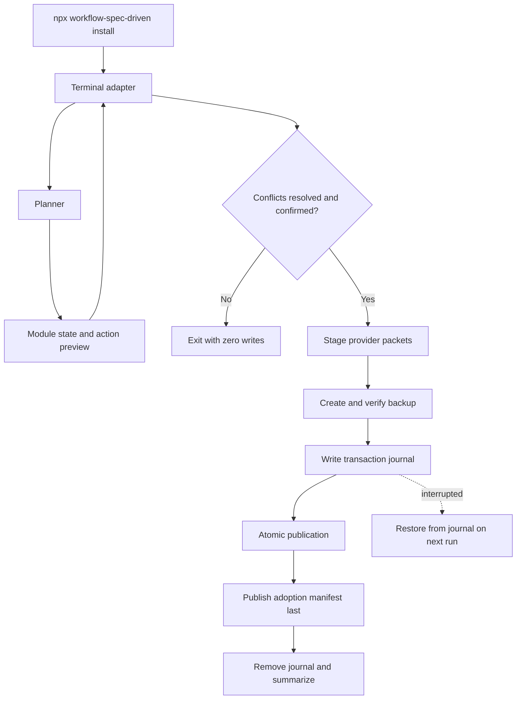

# Interactive Installer Design

**Spec**: `.specs/features/interactive-installer/spec.md`
**Status**: Approved

---

## Architecture Choice

Three approaches can deliver the same guided installer:

| Approach | Strength | Cost | Decision |
| --- | --- | --- | --- |
| Port the adopter and its install-time packet synchronization to JavaScript | Exact `npx` UX, Node-only installation, preserves current safety semantics | Requires a careful parity port and one TOML parser | **Selected** |
| Keep a JavaScript wizard over `adopt.py` | Smallest initial diff | Retains Python 3.11 and does not meet the approved Node-only outcome | Rejected |
| Port planning/publication but skip packet synchronization | Smaller port | Produces an incomplete installation and violates the current contract | Rejected |

The user's instruction to migrate `adopt.py` confirms the selected approach. The design ports only runtime behavior needed by installation. Unrelated validators and workflow helpers remain Python.

## Architecture Overview

The executable owns command parsing and TTY validation. A terminal adapter gathers decisions but never mutates the repository. A pure planner reads the package catalog, target, and adoption state and emits a complete plan. Packet synchronization is a deterministic staging transform. The transaction component creates and verifies backups, writes a recovery journal, publishes planned files atomically, writes adoption state last, and removes the journal only after success.



The transaction boundary covers every selected module. Excluding a module recalculates the plan before confirmation; publication never applies a partial unresolved plan.

---

## Code Reuse Analysis

### Existing Components to Leverage

| Component | Location | How to Use |
| --- | --- | --- |
| Installation catalog and layer closure | `scripts/adopt.py` | Port the catalog and proven dependency rules literally, then remove the Python source after parity. |
| File classification | `scripts/adopt.py` | Preserve `add`, `update`, `claim`, `preserve`, `conflict`, and hash-proven retirement rules; add display-only `replace` and `no change` labels. |
| Managed instruction blocks | `scripts/adopt.py` | Port marker composition and consumer-content preservation exactly. |
| Filesystem preflight | `scripts/adopt.py` | Port root containment, symlink, parent-type, and destination checks before any mutation. |
| Atomic publication and restore | `scripts/adopt.py` | Retain temp-write + rename and restoration semantics, narrowing the snapshot to affected paths backed by a journal. |
| Agent packet templates | `.agents/skills/workflow-config/assets/agents/` | Continue using the tracked templates as the only packet body source. |
| Workflow configuration rules | `.agents/skills/workflow-config/scripts/workflow_config.py` | Port install-time parse/validate/render behavior into one JavaScript adapter; keep resolver behavior outside this feature. |
| Existing package/adoption assertions | `scripts/test_adopt.py`, `tools/shared/tests/qa-skills.test.ts` | Freeze spec-relevant outcomes as parity fixtures, then replace Python-adopter tests with Node tests. |

### Integration Points

| System | Integration Method |
| --- | --- |
| npm/npx | Unscoped package and single homonymous `bin` entry. |
| Git | Read-only `git rev-parse` and `git status --porcelain` with fixed argv, `cwd` bound to target, and `shell: false`. |
| Consumer filesystem | Validated relative paths, `lstat`, SHA-256, atomic rename, explicit modes, backup manifest, transaction journal. |
| Workflow configuration | Parse `.my-workflow.toml` with `smol-toml@1.8.0`; render provider packets from tracked templates. |
| Terminal | `node:readline/promises`; line-oriented prompts and injected input/output adapters for tests. |

---

## Components

### CLI Entrypoint

- **Purpose**: Validate the public command, runtime, TTY, and target before starting the wizard.
- **Location**: `bin/workflow-spec-driven.js`
- **Interfaces**:
  - `main(argv, runtime): Promise<number>` - run `install` or render help.
- **Dependencies**: terminal adapter, planner, transaction coordinator.
- **Reuses**: current ESM package shape and exit-code conventions.

### Catalog

- **Purpose**: Own the four module definitions, dependency closure, installation paths, ownership, retirement paths, and knowledge-transfer destinations.
- **Location**: `scripts/installer/catalog.js`
- **Interfaces**:
  - `resolveModules(selected: ModuleId[]): ModuleId[]`
  - `catalogEntries(modules: ModuleId[]): CatalogEntry[]`
- **Dependencies**: none.
- **Reuses**: current `LAYERS`, `LAYER_DEPENDENCIES`, catalog, and retirement declarations.

### Planner

- **Purpose**: Produce a deterministic, mutation-free module assessment and installation plan.
- **Location**: `scripts/installer/engine.js`
- **Interfaces**:
  - `assessModules(input: AssessmentInput): Promise<ModuleAssessment[]>`
  - `buildPlan(input: PlanInput): Promise<InstallPlan>`
  - `recalculatePlan(plan, decisions): Promise<InstallPlan>`
- **Dependencies**: catalog, Node filesystem/path/crypto APIs.
- **Reuses**: current manifest, hash, managed-block, classification, and retirement semantics.

### Packet Synchronizer

- **Purpose**: Validate local workflow configuration and stage the 18 provider-role runtime packets required by selected modules.
- **Location**: `scripts/installer/packets.js`
- **Interfaces**:
  - `stageAgentPackets(stageRoot, targetRoot): Promise<StagedPacket[]>`
- **Dependencies**: `smol-toml@1.8.0`, tracked packet templates, Node filesystem APIs.
- **Reuses**: existing provider/role matrix, metadata validation, model/effort substitution, and template sources.

Only install-time synchronization is ported. The Python resolver remains authoritative for feature workflow resolution. Cross-language parity tests make drift visible until a later feature chooses one runtime for the whole configuration tool.

### Transaction Coordinator

- **Purpose**: Turn one confirmed plan into a recoverable all-or-nothing filesystem change.
- **Location**: `scripts/installer/transaction.js`
- **Interfaces**:
  - `prepareBackup(plan, clock): Promise<PreparedTransaction>`
  - `publish(prepared): Promise<InstallResult>`
  - `restoreInterrupted(journal): Promise<RestoreResult>`
- **Dependencies**: Node filesystem/path/crypto APIs.
- **Reuses**: current preflight, atomic write, manifest-last, snapshot, and restore invariants.

The coordinator creates backup files and verifies their hashes before the first workflow publication. It atomically writes `.my-workflow/transaction.json` with the backup pointer, original files, added paths, and planned manifest. Caught failures restore immediately. A hard interruption leaves the journal; the next run offers restoration before any new plan.

### Terminal Adapter

- **Purpose**: Render the frozen terminal states and collect module, conflict, recovery, and confirmation decisions.
- **Location**: `scripts/installer/terminal.js`
- **Interfaces**:
  - `runInstallWizard(dependencies): Promise<WizardResult>`
  - `renderPlan(plan, width, color): string`
- **Dependencies**: `node:readline/promises`, planner, transaction coordinator.
- **Reuses**: `.specs/features/interactive-installer/uiux.md` and approved terminal mockups.

The adapter uses numbered text prompts, natural scrollback, and no cursor-control library. Meaning never depends on ANSI color. Input/output are injected so behavioral tests do not fake process globals.

---

## Data Models

### Module and Assessment

```typescript
type ModuleId = "core" | "parallel" | "quality" | "extras"
type ModuleStatus = "not installed" | "up to date" | "outdated" | "modified" | "conflict"

interface ModuleAssessment {
  id: ModuleId
  status: ModuleStatus
  requiredBy: ModuleId[]
  actions: FileAction[]
}
```

Module status is the highest-risk file state in deterministic order: `conflict`, `modified`, `outdated`, `not installed`, `up to date`. The adoption schema remains version 1; module state is derived from its existing package version, layers, per-file ownership, and hashes rather than adding a compatibility migration.

### File Action and Plan

```typescript
type ActionKind = "add" | "update" | "claim" | "replace" | "remove" | "preserve" | "no-change" | "conflict"

interface FileAction {
  path: string
  modules: ModuleId[]
  kind: ActionKind
  sourceSha256?: string
  installedSha256?: string
  mode?: number
  reason: string
  knowledgeDestination?: string
}

interface InstallPlan {
  target: string
  packageVersion: string
  selectedModules: ModuleId[]
  assessments: ModuleAssessment[]
  actions: FileAction[]
  unresolved: string[]
}
```

The planner owns internal `claim`; the UI renders it as `ADOPT`. `replace` exists only after explicit conflict approval. `no-change` is visible but never published.

### Backup Manifest

```typescript
interface BackupEntry {
  path: string
  action: "update" | "replace" | "remove"
  sha256: string
  mode: number
  backup: string
}

interface BackupManifest {
  created_at: string
  package: "workflow-spec-driven"
  version: string
  target: "."
  files: BackupEntry[]
}
```

Backup paths preserve target-relative hierarchy under `files/`. No backup is created for add-only or no-op plans. Backups are retained indefinitely and remain ignored local state.

### Transaction Journal

```typescript
interface TransactionJournal {
  schema: 1
  state: "prepared"
  backup: string
  restore: BackupEntry[]
  removeOnRestore: string[]
  previousAdoptionState: string | null
}
```

The journal is an atomic pointer to already-verified recovery material. Its presence blocks normal installation. Successful restoration removes the journal only after target bytes, modes, and adoption state match the record.

### Knowledge Transfer

```typescript
interface KnowledgeTransfer {
  source: string
  destination: string
  reason: string
  status: "Pending human transfer"
}
```

Destinations are catalog metadata, not model-generated guesses. The installer renders this data into `knowledge-transfer.md` but never reads or interprets the consumer content.

---

## Interaction Design

The UI contract and mockups are authoritative:

- `.specs/features/interactive-installer/uiux.md`
- `docs/design/interactive-installer/terminal-80x24.md`
- `docs/design/interactive-installer/terminal-120x40.md`

The sequence is welcome, module selection, first plan, one-at-a-time conflict decisions, recalculated final plan, final confirmation, append-only progress, and result. `y/N`, EOF, and interrupt default to cancellation before publication. An interrupted transaction inserts a restoration step before welcome.

---

## Error Handling Strategy

| Error Scenario | Handling | User Impact |
| --- | --- | --- |
| No TTY | Reject before target inspection | Exit `2`; exact guidance; zero writes. |
| Invalid target or manifest | Fail closed during preflight | Exit `1`; exact field/path; zero writes. |
| Unsafe path, symlink, or filesystem type | Reject resolved relative path | Exit `1`; outside paths untouched. |
| Missing Git or dirty legacy proof | Fixed-argv Git check fails closed | Exit `1`; zero writes. |
| Unresolved conflict | Keep final confirmation unavailable | User replaces with backup, excludes module, or cancels. |
| Backup copy/hash/mode failure | Remove incomplete backup and stop | Exit `1`; workflow files and adoption state unchanged. |
| Caught publication failure | Restore affected paths from verified backup/journal | Exit `1`; exact prior state restored. |
| Hard interruption | Retain atomic journal and verified backup | Next run offers restoration and blocks new mutation. |
| Packet configuration error | Reject staged output before backup/publication | Exit `1`; zero target writes. |

---

## Risks & Concerns

| Concern | Location (file:line) | Impact | Mitigation |
| --- | --- | --- | --- |
| Mature adopter is one large Python module | `scripts/adopt.py:1` | Literal rewrite can miss hidden invariants. | Freeze spec-owned parity fixtures first; port pure planner before transaction; delete Python only after parity and mutation sensors pass. |
| Install-time packet sync is coupled to Python workflow configuration | `scripts/adopt.py:532`, `.agents/skills/workflow-config/scripts/workflow_config.py:541` | Node-only install could silently produce different agents. | Isolate `packets.js`, parse with one maintained TOML dependency, and assert all 18 packet bytes against canonical fixtures. |
| Existing rollback is in-memory only | `scripts/adopt.py:631` | Process death can leave an unexplained partial tree. | Persist verified backup plus atomic transaction journal before publication. |
| Existing manifest has no module-level version | `scripts/adopt.py:269` | A new schema would introduce migration/compatibility work. | Derive aggregate state from existing layer membership and per-file hashes; keep schema 1. |
| Terminal behavior has no current harness | `bin/my-workflow.js:1` | Unit tests alone could miss prompt order and cancellation. | Inject terminal adapters for automated tests and run fresh PTY QA against the packed tarball. |
| Knowledge destinations can become semantic guesses | `docs/guidelines/KNOWLEDGE-WIKI.md:42` | Automatic movement could corrupt consumer context. | Destinations are explicit catalog metadata; output a pending checklist and never merge. |
| Scoped package `0.10.0` already exists | `package.json:2` | Users may confuse historical and canonical package names. | Hard-cut local metadata/docs to unscoped package; leave scoped registry version immutable and publish only after separate authorization. |

---

## Tech Decisions

| Decision | Choice | Rationale |
| --- | --- | --- |
| Installer runtime | Node.js 18 ESM | Makes the canonical `npx` journey self-contained while preserving post-install Python tools. |
| Terminal UI | `node:readline/promises`, no prompt framework | Four modules and three conflict choices do not justify a dependency or full-screen TUI. |
| TOML parsing | `smol-toml@1.8.0`, `parse` only | Node 18-compatible ESM, zero transitive dependencies, TOML 1.1 support; handwritten parsing is unsafe. |
| Adoption state | Keep schema 1 and derive module status | Avoids a compatibility migration while retaining current provenance. |
| Recovery | Verified per-path backup plus atomic journal | Bounded recovery survives both thrown errors and process interruption. |
| Knowledge handling | Static destination metadata and manual checklist | Preserves human approval and consumer ownership. |
| Public compatibility | Hard cut to unscoped package and homonymous binary | Produces the requested command without a second current interface. |

The installer runtime choice is project-level and is recorded as AD-030 in `.specs/STATE.md`.
