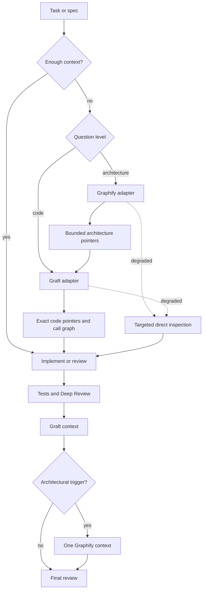

# Repository Intelligence Routing Design

**Spec**: `.specs/features/repository-intelligence-routing/spec.md`
**Status**: Approved by the operator's “proceed, replace” directive

---

## Architecture Overview

The workflow owns a thin provider-neutral repository-intelligence adapter instead of allowing vendor installers to rewrite managed agent instructions. Role packets route architectural questions to Graphify and code questions to Graft. The adapter validates exact tool versions, refreshes checkout-local state, serializes mutations, emits bounded context and degraded reasons, and records invocation metadata. Native search remains available only for exact-text work or an explicit degraded/insufficient result.



Generated state is owned by the active checkout:

```text
<checkout>/
├── graft/                          # Graft cards and graph, ignored
├── graphify-out/                   # Graphify graph and reports, ignored
└── .repository-intelligence/       # locks, fingerprints, backend choice, metrics, ignored
```

The adapter records the Git tree object produced from a temporary index refreshed with all non-ignored files, reusing the AD-018 fingerprint rule. Tool-native freshness remains the first mechanism: Graft queries auto-refresh with hash checking; Graphify runs incremental update/check before queries. The adapter fingerprint prevents another checkout or incomplete representation from being accepted.

---

## Research Findings

- Graft `0.10.1` provides `ask`, `skeleton`, `callers --direction out`, `grep`, `map`, `check`, and six MCP tools. Its queries refresh before answering and `GRAFT_REFRESH=hash` forces content hashing.
- Graphify `0.9.14` provides `query`, `path`, `explain`, `affected`, `update`, `check-update`, `extract --code-only`, semantic extraction through explicit backends, and project installation hooks.
- `graft init` and `graphify install --project` are rejected for this integration because they write agent instruction or host configuration outside the workflow-owned packet renderer.
- The current checkout's local Graphify code-only build produced 1,938 nodes and 5,977 edges. It skipped 644 non-code files, so it proves executable integration but not full product/document understanding.
- Semantic Graphify extraction requires an explicit backend. `claude-cli` is the initial backend for this operator's checkout; the workflow pack does not assume that provider for consumers.

---

## Code Reuse Analysis

### Existing Components to Leverage

| Component | Location | How to Use |
| --- | --- | --- |
| Git tree fingerprint | `tools/gate_cache.py:31` | Reuse its temporary-index algorithm inside the installed adapter; keep one canonical behavior test. |
| Kernel lock behavior | `.agents/skills/autonomous/scripts/resource_lock.py` | Reuse its private-directory, `flock`, timeout, and holder-diagnostic rules for per-checkout graph mutation. |
| Graft review context | `.agents/skills/deep-review/scripts/graft_context.py` | Replace opt-in binary/build logic with calls through the shared adapter while preserving bounded map/symbol/caller output. |
| Deep Review job materialization | `.agents/skills/deep-review/scripts/build_jobs.py` | Always prepare Graft; accept one explicit Graphify architecture question for an architecturally triggered run. |
| Canonical role packet rendering | `.agents/skills/workflow-config/assets/agents/` and `scripts/installer/packets.js` | Put role-specific routing in tracked templates; regenerate local runtime packets. |
| Installer transaction | `scripts/installer/engine.js` and `scripts/installer/transaction.js` | Add ignored paths and version-pinned remediation text without installing external tools or touching application dependencies. |
| Deep Review metrics pattern | `.agents/skills/deep-review/scripts/token_metrics.py` | Reuse explicit `unavailable` values and content-safe records; do not infer unsupported token counts. |

### Integration Points

| System | Integration Method |
| --- | --- |
| Specify/Design | Planner delegates an architectural trace to Explorer when the spec names an architectural trigger; the bounded result enters `design.md`. |
| Execute | Explorer and Implementer packets invoke Graft first when code location or call relationships are unknown. |
| Deep Review | `build_jobs.py` always prepares Graft and prepares Graphify only when `--graphify-question` carries the recorded architectural uncertainty. |
| Adoption | Core installs routing/adapter/packet changes and ignore rules; result summary reports exact supported versions and install commands. |
| Benchmark | Adapter writes one ignored JSONL event per invocation; a small report command validates controlled run records. |

---

## Components

### Repository intelligence adapter

- **Purpose**: Provide one safe, bounded execution contract for Graphify and Graft across workflow roles.
- **Location**: `.agents/skills/workflow-spec-driven/scripts/repository_intelligence.py`
- **Interfaces**:
  - `status --root <path> --json` — report tool versions, graph state, backend, checkout and fingerprint.
  - `graft --root <path> <ask|skeleton|callers|grep|map> [args...]` — validate, refresh and run a bounded Graft query.
  - `graphify --root <path> <query|path|explain|affected> [args...]` — validate/update and run a bounded Graphify query.
  - `graphify-setup --root <path> --backend <name> [--mode deep]` — disclose scope/backend, build the initial graph and persist non-secret local backend metadata.
  - `benchmark-report --input <jsonl>` — reject mismatched controls and summarize terminal runs.
- **Dependencies**: Python standard library, Git, exact supported CLIs.
- **Reuses**: AD-018 tree fingerprint and AD-017 lock safety rules.

The adapter returns status `ready`, `partial`, or `degraded`. Exit `0` means context was produced; a dedicated non-zero degraded exit lets the caller state the reason and continue through targeted inspection. It never executes a shell string.

### Routing reference

- **Purpose**: Own the single routing and fallback rule loaded by phase skills and role packets.
- **Location**: `.agents/skills/workflow-spec-driven/references/code-analysis.md`
- **Interfaces**: Existing context → Graphify architecture route → Graft code route → targeted native fallback.
- **Dependencies**: Repository intelligence adapter.
- **Reuses**: Existing code-analysis reference; the old `ast-grep → rg → grep` priority is replaced, not retained beside the new rule.

### Role packet integration

- **Purpose**: Make the routing operational in every supported host.
- **Location**: `.agents/skills/workflow-config/assets/agents/{claude,codex,cursor}/`
- **Interfaces**:
  - Planner/Designer: Graphify for recorded architectural uncertainty; no code discovery duplication.
  - Explorer: Graphify for assigned architecture traces, then Graft for code discovery; native fallback must state degradation.
  - Implementer: Graft when the slice packet lacks sufficient code pointers.
  - Deep Reviewer: consume prepared Graft/Graphify artifacts and verify every claim against the frozen checkout.
- **Dependencies**: Packet renderer and sync command.
- **Reuses**: Existing canonical-template generation.

### Deep Review architecture context

- **Purpose**: Add one conditional Graphify artifact while making Graft standard for every selected Deep Review.
- **Location**: `.agents/skills/deep-review/scripts/graphify_context.py`, `graft_context.py`, and `build_jobs.py`
- **Interfaces**:
  - `prepare_graphify_context(repo, out, question)` writes `graphify-context.md`.
  - `build_jobs.py --graphify-question <question>` selects Graphify exactly once for the run.
  - Absent `--graphify-question` means no Graphify process.
- **Dependencies**: Shared repository intelligence adapter.
- **Reuses**: Existing prompt artifact injection and non-blocking Graft fallback shape.

The coordinator owns trigger classification. Valid triggers are boundary change, responsibility transfer, shared abstraction, central flow, or residual architectural uncertainty. File count alone never selects Graphify. The question is recorded in the run artifact so dual-tool use is auditable and non-duplicate.

### Adoption and hygiene contract

- **Purpose**: Ship the default behavior without production dependency or vendor-owned instruction writes.
- **Location**: installer catalog/summary, `.gitignore`, `.ignore`, README and QA adoption scenarios.
- **Interfaces**:
  - Supported Graft: `@nanonets/graft@0.10.1`.
  - Supported Graphify: `graphifyy==0.9.14`.
  - Installer reports exact remediation; it does not execute package-manager commands.
- **Dependencies**: Existing transactional installer.
- **Reuses**: Preview, conflict, backup, cancellation and recovery behavior unchanged.

### Benchmark ledger

- **Purpose**: Collect directional evidence without pretending host telemetry exists.
- **Location**: `.repository-intelligence/benchmark.jsonl` and a durable promoted report only after 10–20 terminal tasks.
- **Interfaces**: One record per controlled task configuration with explicit `unavailable` metric values.
- **Dependencies**: Adapter invocation events plus operator/provider telemetry.
- **Reuses**: Deep Review's content-safe telemetry rules and independent gate/Verifier evidence.

---

## Data Models

### Intelligence state

```json
{
  "schema": 1,
  "tool": "graft | graphify",
  "tool_version": "0.10.1 | 0.9.14",
  "checkout": "/absolute/checkout/path",
  "tree": "git-tree-object",
  "backend": "not-applicable | code-only | configured-name",
  "source_scope": ["repo-relative/root"],
  "status": "ready | partial | degraded",
  "built_at": "RFC3339 timestamp"
}
```

### Invocation event

```json
{
  "schema": 1,
  "run_id": "opaque-id",
  "phase": "specify | design | execute | deep-review",
  "tool": "graft | graphify | native",
  "question_kind": "architecture | code | exact-text | fallback",
  "question_hash": "sha256",
  "tree": "git-tree-object",
  "duration_ms": 0,
  "status": "ready | partial | degraded",
  "reason": null
}
```

Queries are hashed rather than persisted because task prompts may contain product or customer data.

### Benchmark task record

```json
{
  "schema": 1,
  "task_id": "stable-id",
  "category": "local | bug | cross-cutting | architectural | refactor",
  "configuration": "baseline | graft | routed",
  "tree": "git-tree-object",
  "prompt_hash": "sha256",
  "acceptance_contract_hash": "sha256",
  "provider": "provider-id",
  "model": "model-id",
  "effort": "effort-id",
  "metrics": {
    "input_tokens": "integer | unavailable",
    "output_tokens": "integer | unavailable",
    "tool_calls": "integer | unavailable",
    "direct_files_read": "integer | unavailable",
    "wall_clock_ms": "integer | unavailable",
    "native_fallback_calls": 0,
    "rework_count": 0,
    "review_findings": 0
  },
  "gate": "PASS | FAIL",
  "verifier": "PASS | FAIL | not-applicable",
  "outcome": "success | failure | blocked"
}
```

---

## Error Handling Strategy

| Error Scenario | Handling | Operator impact |
| --- | --- | --- |
| Tool missing or wrong version | Return degraded status with exact install command and expected/actual version | Agent performs targeted fallback and records degradation once for the phase. |
| Graft stale | Run hash-based native refresh; reject if `check` still fails | No stale code pointers enter the task. |
| Graphify graph missing | Return setup-required with exact version and backend command | Architectural work pauses only for that tool; targeted inspection remains available. |
| Graphify semantic update pending | Mark partial; require explicit backend rebuild before claiming document/product coverage | Code graph may guide, but product understanding is not claimed complete. |
| Remote backend undisclosed or credentials absent | Refuse semantic extraction before content is sent | No accidental upload or misleading success. |
| Command timeout or interruption | Mark degraded; never publish matching fingerprint metadata | Last complete matching representation remains usable; otherwise fallback. |
| Concurrent mutation | Wait on checkout-local lock with bounded timeout | One builder publishes; readers never consume an in-progress state. |
| Oversized output | Keep exact paths, nodes and relationships within phase budget | Agent receives useful pointers without context flood. |

---

## Risks & Concerns

| Concern | Location (file:line) | Impact | Mitigation |
| --- | --- | --- | --- |
| Current Graft adapter is review-specific and opt-in | `.agents/skills/deep-review/scripts/graft_context.py:57` | Cannot satisfy implementation discovery or standard review behavior | Put execution/freshness in the shared adapter and keep review rendering thin. |
| Current packets direct Explorer to Grep/Glob | `.agents/skills/workflow-config/assets/agents/codex/explorer.toml:1` | Agents may continue broad discovery despite documentation | Update every canonical provider packet and assert ordering in packet tests. |
| Graphify code-only omits product documents | `graphify extract --code-only` evidence from 2026-09-10 | Architecture result can look complete while 644 docs were skipped | Persist backend/mode and label code-only context partial for product-level questions. |
| Semantic Graphify can send repository content externally | Graphify `extract --backend` contract | Privacy/cost surprise | Require explicit backend, disclose scope, use environment-owned credentials and redact logs. |
| Graphify query can return very broad BFS output | Local query returned 392 nodes for a review question | Context savings can reverse | Enforce query budget and prefer `path`, `explain`, or `affected` for precise questions. |
| Current QA protects optional Graft behavior | `docs/qa/scenarios/QAS-use-graft-context-with-plain-fallback.md:19` | Old tests will reject the new standard | Replace expectations in the canonical scenarios; do not weaken unrelated fallback checks. |
| Installer deliberately avoids Python prerequisites | `.specs/STATE.md` AD-030 | Automatic Graphify installation would break canonical adoption | Detect and print separate version-pinned setup; keep Node installer behavior unchanged. |

---

## Tech Decisions

| Decision | Choice | Rationale |
| --- | --- | --- |
| Integration ownership | Workflow-owned CLI adapter and canonical packets | Prevents vendor installers from rewriting managed instructions and hooks. |
| Tool priority | Existing context → Graphify for architecture → Graft for code → targeted native fallback | Implements the operator's routing principle without duplicate retrieval. |
| Graft review default | Always attempt Graft when Deep Review is selected | Replaces the legacy opt-in policy. |
| Graphify review trigger | Explicit `--graphify-question` supplied from a recorded architecture risk | Makes conditional use auditable and avoids running Graphify on every review. |
| Tool installation | Explicit, exact-version development setup outside the application runtime | Keeps adoption transactional and provider/toolchain neutral. |
| Graphify backend | Explicit per-checkout local metadata; `claude-cli` for this checkout, no provider assumption in the pack | Preserves privacy disclosure and consumer choice without weakening Graphify routing. |
| Freshness | Tool-native refresh plus AD-018 Git tree fingerprint | Reuses existing guarantees instead of inventing a second file walker. |
| Benchmark | Ignored event/record ledger; durable report only after terminal sample | Measures provisional adoption without permanently growing every agent prompt. |
